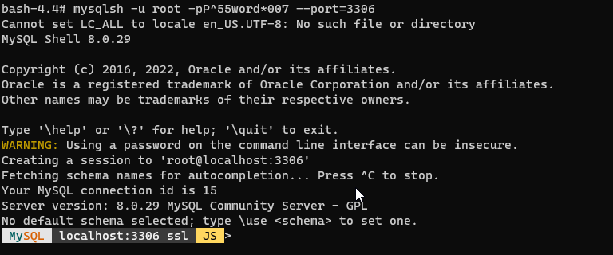

# dockerised-seeded-mysql-db
Starts up a MySql instance in a docker container and creates a ready seeded database based on an initialisation SQL script

### Overview

This project provides a set of instructions on creating and interacting with a database hosted inside a docker container

### Create Dockerfile

1. A `Dockerfile` is a text file with instructions on creating a docker image.

2. Create the `Dockerfile`, a plain text file then copy and paste the content shown below

There is one ready prepared in the **assets folder** in this repository if you prefer

```dockerfile
FROM mysql:8.0.29
LABEL maintainer="mp30028" \
      email="mp30028@gmail.com" \
      description="Dockerfile with MySql-Server"
ENV MYSQL_ROOT_PASSWORD P^55word*007
ENV MYSQL_DATABASE addressbook
ADD create_db.sql /docker-entrypoint-initdb.d
EXPOSE 3306
```

### Create the SQL script that will be run when the image is built

1. An example script from which the snippet below is taken can be found in create_db.sql in the **assets folder** in this repository

```sql
DROP DATABASE IF EXISTS `addressbook`;
CREATE DATABASE `addressbook`;
USE `addressbook`;
....
....
....
DROP USER IF EXISTS addrbkuser@localhost;
CREATE USER addrbkuser@localhost IDENTIFIED BY 'addr3ssb00k';
GRANT ALL PRIVILEGES ON addressbook.* TO addrbkuser@localhost;
```

2. This script should be kept in the same folder as the `Dockerfile`


### Build the image

Now build the image based on the instructions in the `Dockerfile`

1. Change into the directory where the `Dockerfile` is located

2. Ensure you have the docker service running. If you are on a local workstation all you need to do is start up `Docker Desktop`

3. Open a terminal window on your workstation. Type `docker --version` to confirm docker is setup correctly


4. Run the following command to build the image `docker build -t mp30028/addbookdb .` You should see output similar to the illustration below


5. Check that the image has been created successfully with the following `docker images`


6. In case something goes wrong the image can be removed with `docker rmi mp30028/addbookdb`

### Use the image to start a container

Once the image has been created, a container from the image has to be loaded and started before it is possible to interact with it. There are several ways to do this. When doing so the first time it is best to use the `docker run ...` command.

1. Start the container `docker run -d -p 3306:3306 --name addbkmysql mp30028/addbookdb`


2. Check its running ok `docker ps`


### Interact with the container

To interact with the MySql db inside the container is no different to interacting with MySql installed directly on the workstation. But there is a more interesting way to interact with it by actually going into the container. A bit like using ssh to get on to a remote server.

1. Start a `bash` console inside the running container with `docker exec -it addbkmysql bash`. This should bring you to a bash prompt inside the container


2. Now start a command line MySql shell from the `bash` prompt `mysqlsh -u root -pP^55word*007 --port=3306`


3. Type `\sql` to get to the SQL-Shell


